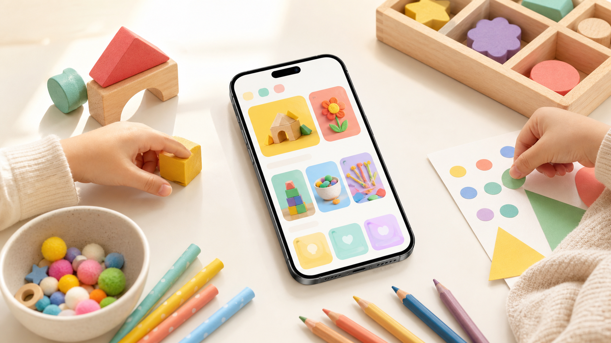
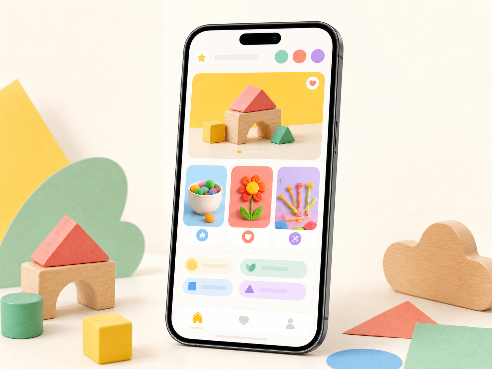
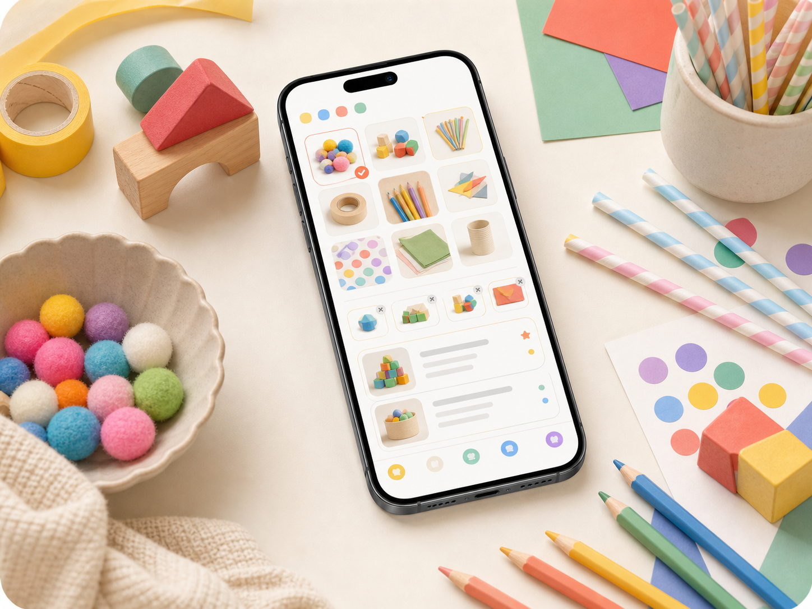
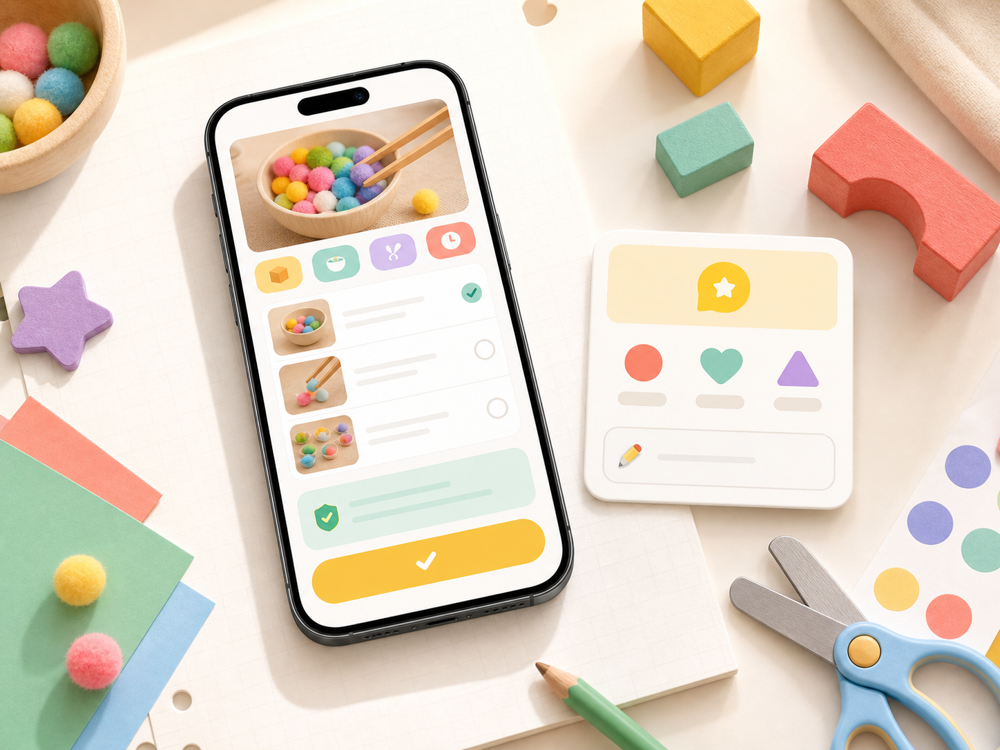

<div align="center">
  

  <h1>놀이 레시피</h1>
  <p><strong>집에 있는 재료로 오늘 할 놀이를 고르는 육아 놀이 추천 앱</strong></p>

  <p>
    0-48개월 · 191개 놀이 · 48개 표준 재료 · 로컬 퍼스트
  </p>
</div>

## 한 줄 소개

**놀이 레시피**는 아이의 월령, 집에 있는 재료, 최근 놀이 기록을 바탕으로 보호자가 오늘 바로 시작할 수 있는 놀이를 추천하는 모바일 앱입니다. 단순한 놀이 목록이 아니라, 실제 가정에서 가능한 준비물과 아이의 발달 단계까지 함께 고려합니다.

## 왜 필요한가요

아이와 놀아주는 일은 중요하지만, 매번 좋은 놀이를 떠올리는 일은 쉽지 않습니다. 보호자는 보통 이런 질문 앞에서 멈춥니다.

- 지금 아이 월령에 맞는 놀이일까?
- 집에 있는 재료만으로 바로 할 수 있을까?
- 준비가 너무 번거롭지는 않을까?
- 오늘은 어떤 발달 영역을 자극해주면 좋을까?
- 전에 했던 놀이와 너무 비슷하지는 않을까?

놀이 레시피는 이 판단 과정을 앱이 대신 정리해줍니다. 보호자는 놀이를 검색하고 비교하는 시간보다, 아이와 실제로 노는 시간에 더 집중할 수 있습니다.

## 앱의 핵심 가치

| 가치 | 설명 |
| --- | --- |
| 상황 맞춤 추천 | 아이 월령, 장소, 보유 재료, 최근 기록을 바탕으로 추천합니다. |
| 준비물 현실성 | 종이, 스티커, 빨대, 블록, 그릇처럼 집에서 찾기 쉬운 재료를 기준으로 탐색합니다. |
| 발달 균형 | 소근육, 대근육, 인지, 언어, 정서, 사회성, 감각 영역을 함께 고려합니다. |
| 빠른 실행 | 놀이 시간, 준비 시간, 난이도를 미리 보여줘 바로 시작할 수 있게 합니다. |
| 안전한 진행 | 놀이 단계와 함께 안전 유의사항을 제공해 보호자가 놓치기 쉬운 부분을 확인합니다. |
| 반복 관리 | 완료 기록과 즐겨찾기를 통해 했던 놀이와 다시 하고 싶은 놀이를 관리합니다. |

## 주요 화면 미리보기

| 오늘의 놀이 추천 | 재료 기반 탐색 | 놀이 상세와 기록 |
| --- | --- | --- |
|  |  |  |
| 아이 월령과 최근 기록을 반영해 지금 할 놀이를 먼저 보여줍니다. | 집에 있는 재료를 고르면 가능한 놀이를 빠르게 좁혀줍니다. | 놀이 단계, 안전 유의사항, 완료 기록과 아이 반응을 연결합니다. |

## 주요 경험

### 오늘의 놀이 추천

홈 화면은 보호자에게 지금 가장 필요한 결정을 먼저 보여줍니다. 아이에게 맞고, 집에 있는 재료로 가능하며, 최근에 너무 자주 하지 않은 놀이를 우선 추천합니다.

추천 카드에서는 적정 월령, 발달 영역, 준비물 상태, 완료 여부를 함께 확인할 수 있어 여러 놀이를 오래 비교하지 않아도 됩니다.

### 재료에서 시작하는 탐색

보호자는 놀이명을 몰라도 괜찮습니다. 오늘 집에 있는 재료를 고르면 그 재료로 가능한 놀이를 찾을 수 있습니다.

예를 들어 스티커, 종이, 그릇, 빨대, 블록, 물감처럼 일상적인 재료를 중심으로 놀이가 연결됩니다. 준비물이 부족한 경우에는 어떤 재료가 더 필요한지도 함께 보여줍니다.

### 발달 영역을 고려한 놀이 선택

놀이는 재미뿐 아니라 발달 경험이기도 합니다. 놀이 레시피는 각 놀이에 소근육, 대근육, 인지, 언어, 정서, 사회성, 감각 영역을 연결해 보호자가 오늘의 놀이 의도를 쉽게 이해할 수 있게 합니다.

### 단계별 놀이 가이드

놀이 상세 화면에서는 준비물, 진행 순서, 안전 유의사항, 교육 효과를 한 흐름으로 제공합니다. 보호자가 긴 설명을 읽지 않아도 놀이를 시작할 수 있도록 단계 중심으로 구성했습니다.

### 기록과 피드백

완료한 놀이는 기록으로 남고, 아이가 어떻게 반응했는지도 함께 저장할 수 있습니다. 집중했는지, 스스로 했는지, 도움이 필요했는지 같은 반응은 이후 추천 품질을 높이는 단서가 됩니다.

## 화면 흐름

```text
아이 정보 입력
  ↓
보유 재료 선택
  ↓
오늘의 추천 놀이 확인
  ↓
놀이 상세에서 준비물과 단계 확인
  ↓
놀이 완료 기록과 아이 반응 저장
  ↓
다음 추천에 최근 기록 반영
```

## 화면별 역할

| 화면 | 역할 |
| --- | --- |
| 온보딩 | 아이 생년월과 집에 있는 재료를 설정합니다. |
| 홈 | 오늘 추천할 놀이와 상황별 탐색 진입점을 보여줍니다. |
| 검색 | 월령, 장소, 재료, 발달 영역 기준으로 놀이를 찾습니다. |
| 놀이 상세 | 준비물, 놀이 단계, 안전 유의사항, 교육 효과를 확인합니다. |
| 피드백 | 놀이 후 아이 반응을 기록합니다. |
| 기록 | 완료한 놀이 이력을 확인합니다. |
| 즐겨찾기 | 다시 해보고 싶은 놀이를 모아둡니다. |
| 마이페이지/설정 | 아이 정보와 앱 사용 조건을 관리합니다. |

## 추천은 이렇게 동작합니다

놀이 레시피의 추천은 단순히 인기순이나 최신순으로 정렬하지 않습니다. 보호자의 현재 상황에 맞는 후보를 먼저 걸러낸 뒤, 여러 기준을 조합해 상위 놀이를 고릅니다.

### 1. 먼저 맞지 않는 놀이를 제외합니다

- 아이 월령 범위에 맞지 않는 놀이
- 현재 장소 조건과 맞지 않는 놀이
- 가능한 시간보다 지나치게 긴 놀이
- 보호자가 제외한 재료가 포함된 놀이
- 공개 상태가 아닌 놀이

### 2. 남은 놀이에 점수를 매깁니다

- 보유 재료와 필수 준비물의 일치도
- 아이에게 필요한 발달 영역과의 관련성
- 놀이 시간의 적절성
- 이전 피드백과 아이 반응
- 최근 완료한 놀이와의 중복 여부

### 3. 결과의 다양성을 조정합니다

점수가 높은 놀이만 고르면 비슷한 발달 영역이나 비슷한 재료의 놀이가 반복될 수 있습니다. 놀이 레시피는 추천 결과가 한쪽으로 치우치지 않도록 상위 후보를 조정합니다.

## 콘텐츠 구성

| 항목 | 내용 |
| --- | --- |
| 대상 월령 | 0-48개월 |
| 놀이 수 | 191개 |
| 재료 체계 | 7개 카테고리, 48개 표준 재료 |
| 발달 영역 | 소근육, 대근육, 인지, 언어, 정서, 사회성, 감각 |
| 장소 | 실내, 실외, 어디서나 |
| 놀이 정보 | 준비물, 진행 단계, 안전 유의사항, 교육 효과, 태그, 출처 |

## 다른 놀이 콘텐츠와 다른 점

### 랜덤 추천이 아닙니다

아이의 나이와 집의 재료 상황을 먼저 보고 추천합니다. 그래서 보기에는 좋아도 당장 하기 어려운 놀이보다, 지금 실제로 가능한 놀이가 먼저 나옵니다.

### 준비 부담을 낮춥니다

놀이를 위해 특별한 교구를 사야 한다는 전제를 줄였습니다. 종이, 그릇, 스티커, 빨대, 블록처럼 이미 집에 있을 가능성이 높은 재료를 중심으로 콘텐츠를 구성했습니다.

### 발달 의도를 보여줍니다

보호자는 놀이를 고르면서 자연스럽게 어떤 발달 영역과 연결되는지 확인할 수 있습니다. 재미와 발달 정보를 분리하지 않고 하나의 선택 과정 안에 둡니다.

### 기록이 다음 추천으로 이어집니다

완료한 놀이와 아이 반응은 단순한 로그로 끝나지 않습니다. 최근에 한 놀이를 피하고, 아이 반응을 추천에 반영하는 방식으로 다음 선택을 더 똑똑하게 만듭니다.

## 디자인 방향

놀이 레시피의 화면은 보호자가 반복해서 쓰는 생활 도구에 가깝게 설계합니다.

- 밝고 따뜻한 색감으로 육아 앱의 부담을 낮춥니다.
- 카드와 배지를 사용해 월령, 재료 상태, 발달 영역을 빠르게 스캔할 수 있게 합니다.
- 긴 설명보다 단계별 행동과 핵심 정보를 먼저 보여줍니다.
- 추천 화면은 탐색보다 선택에 집중하도록 구성합니다.

## 로컬 퍼스트

놀이 레시피는 서버 의존도를 낮춘 로컬 중심 앱입니다. 놀이 콘텐츠와 사용자 기록은 앱 안에서 빠르게 접근할 수 있도록 구성되어 있으며, 기본 사용 경험은 네트워크 연결보다 기기 내 데이터 흐름을 우선합니다.

## 비공개 놀이 이미지

놀이 상세 이미지는 공개 저장소에 포함하지 않습니다. `images/plays/`는 Git에서 제외하고, 실제 `play_001.jpeg`부터 `play_191.jpeg`까지의 파일은 로컬 또는 private 저장소에서 관리합니다.

빌드 전에 private 이미지 폴더를 프로젝트의 `images/plays/` 위치로 복사합니다.

```bash
pnpm prepare:play-images /path/to/private/images/plays
pnpm check:play-images
```

EAS Build를 사용할 때는 로컬에 이미지가 준비된 상태에서 `eas build`를 실행합니다. `.easignore`는 Git에는 올리지 않는 `images/plays/`를 EAS build archive에는 포함하도록 설정되어 있습니다.

## 에셋 라이선스

이 저장소의 이미지 에셋은 프로젝트 전용 자산입니다. 자세한 조건은 [ASSET-LICENSE.md](ASSET-LICENSE.md)를 확인하세요.
