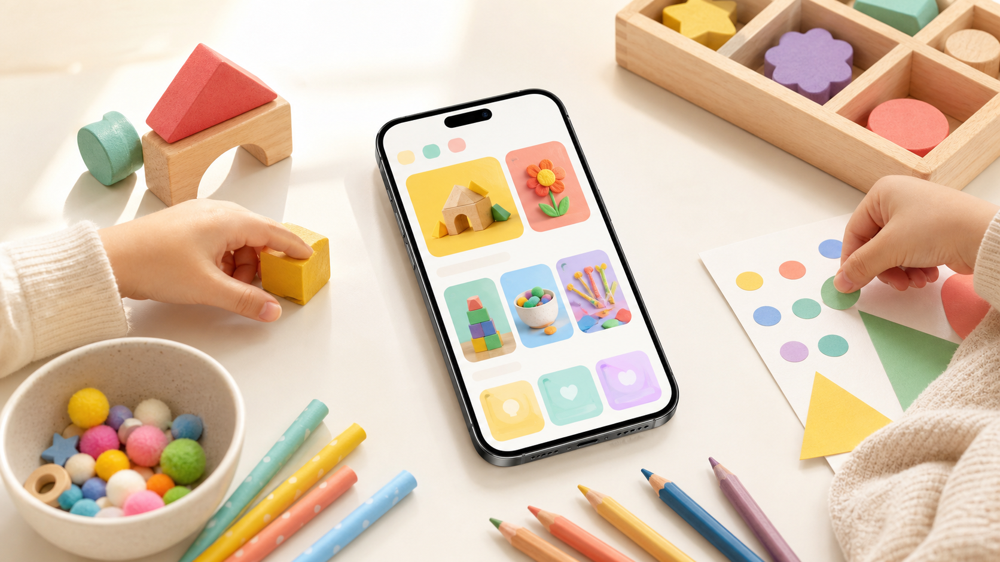
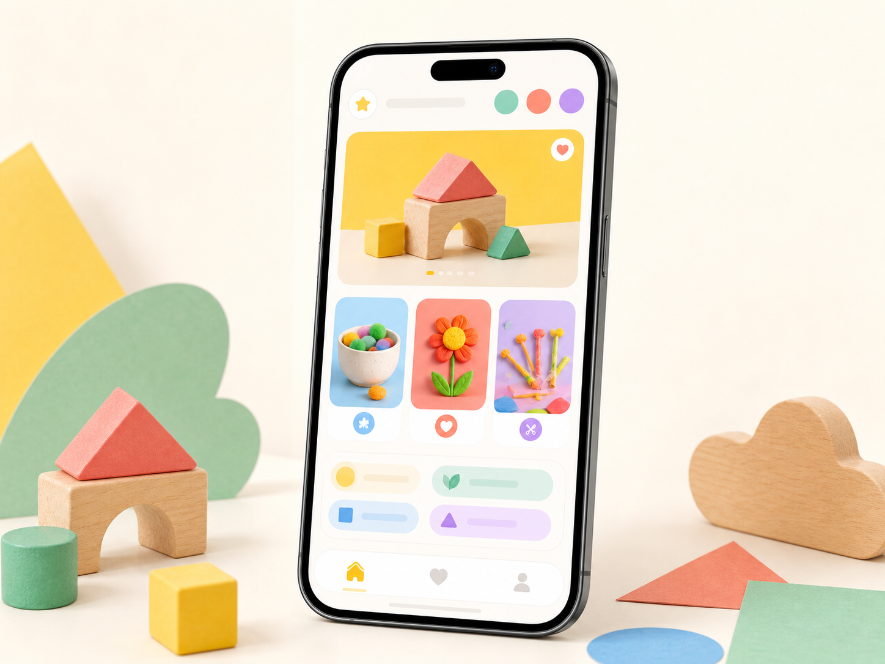
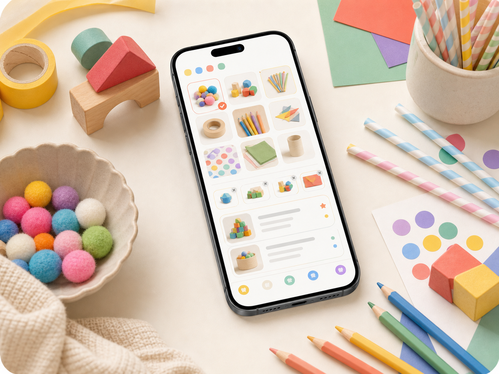
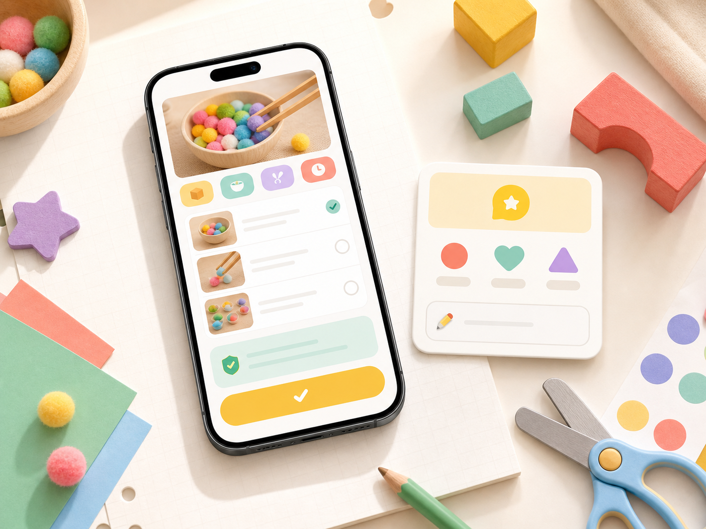

<div align="center">
  

  <h1>놀이 레시피</h1>
  <p><strong>집에 있는 재료로 오늘 할 놀이를 고르는 육아 놀이 추천 앱</strong></p>

  <p>
    0-48개월 · 191개 놀이 · 48개 표준 재료 · 로컬 퍼스트
  </p>
</div>

## 한 줄 소개

**놀이 레시피**는 아이의 월령, 집에 있는 재료, 최근 놀이 기록을 바탕으로 보호자가 오늘 바로 시작할 수 있는 놀이를 추천하는 모바일 앱입니다. 단순한 놀이 목록이 아니라, 실제 가정에서 가능한 준비물과 아이의 발달 단계까지 함께 고려합니다.

## 왜 필요한가요

아이와 놀아주는 일은 중요하지만, 매번 좋은 놀이를 떠올리는 일은 쉽지 않습니다. 보호자는 보통 이런 질문 앞에서 멈춥니다.

- 지금 아이 월령에 맞는 놀이일까?
- 집에 있는 재료만으로 바로 할 수 있을까?
- 준비가 너무 번거롭지는 않을까?
- 오늘은 어떤 발달 영역을 자극해주면 좋을까?
- 전에 했던 놀이와 너무 비슷하지는 않을까?

놀이 레시피는 이 판단 과정을 앱이 대신 정리해줍니다. 보호자는 놀이를 검색하고 비교하는 시간보다, 아이와 실제로 노는 시간에 더 집중할 수 있습니다.

## 앱의 핵심 가치

| 가치 | 설명 |
| --- | --- |
| 상황 맞춤 추천 | 아이 월령, 장소, 보유 재료, 최근 기록을 바탕으로 추천합니다. |
| 준비물 현실성 | 종이, 스티커, 빨대, 블록, 그릇처럼 집에서 찾기 쉬운 재료를 기준으로 탐색합니다. |
| 발달 균형 | 소근육, 대근육, 인지, 언어, 정서, 사회성, 감각 영역을 함께 고려합니다. |
| 빠른 실행 | 놀이 시간, 준비 시간, 난이도를 미리 보여줘 바로 시작할 수 있게 합니다. |
| 안전한 진행 | 놀이 단계와 함께 안전 유의사항을 제공해 보호자가 놓치기 쉬운 부분을 확인합니다. |
| 반복 관리 | 완료 기록과 즐겨찾기를 통해 했던 놀이와 다시 하고 싶은 놀이를 관리합니다. |

## 주요 화면 미리보기

| 오늘의 놀이 추천 | 재료 기반 탐색 | 놀이 상세와 기록 |
| --- | --- | --- |
|  |  |  |
| 아이 월령과 최근 기록을 반영해 지금 할 놀이를 먼저 보여줍니다. | 집에 있는 재료를 고르면 가능한 놀이를 빠르게 좁혀줍니다. | 놀이 단계, 안전 유의사항, 완료 기록과 아이 반응을 연결합니다. |

## 주요 경험

### 오늘의 놀이 추천

홈 화면은 보호자에게 지금 가장 필요한 결정을 먼저 보여줍니다. 아이에게 맞고, 집에 있는 재료로 가능하며, 최근에 너무 자주 하지 않은 놀이를 우선 추천합니다.

추천 카드에서는 적정 월령, 발달 영역, 준비물 상태, 완료 여부를 함께 확인할 수 있어 여러 놀이를 오래 비교하지 않아도 됩니다.

### 재료에서 시작하는 탐색

보호자는 놀이명을 몰라도 괜찮습니다. 오늘 집에 있는 재료를 고르면 그 재료로 가능한 놀이를 찾을 수 있습니다.

예를 들어 스티커, 종이, 그릇, 빨대, 블록, 물감처럼 일상적인 재료를 중심으로 놀이가 연결됩니다. 준비물이 부족한 경우에는 어떤 재료가 더 필요한지도 함께 보여줍니다.

### 발달 영역을 고려한 놀이 선택

놀이는 재미뿐 아니라 발달 경험이기도 합니다. 놀이 레시피는 각 놀이에 소근육, 대근육, 인지, 언어, 정서, 사회성, 감각 영역을 연결해 보호자가 오늘의 놀이 의도를 쉽게 이해할 수 있게 합니다.

### 단계별 놀이 가이드

놀이 상세 화면에서는 준비물, 진행 순서, 안전 유의사항, 교육 효과를 한 흐름으로 제공합니다. 보호자가 긴 설명을 읽지 않아도 놀이를 시작할 수 있도록 단계 중심으로 구성했습니다.

### 기록과 피드백

완료한 놀이는 기록으로 남고, 아이가 어떻게 반응했는지도 함께 저장할 수 있습니다. 집중했는지, 스스로 했는지, 도움이 필요했는지 같은 반응은 이후 추천 품질을 높이는 단서가 됩니다.

## 화면 흐름

```text
아이 정보 입력
  ↓
보유 재료 선택
  ↓
오늘의 추천 놀이 확인
  ↓
놀이 상세에서 준비물과 단계 확인
  ↓
놀이 완료 기록과 아이 반응 저장
  ↓
다음 추천에 최근 기록 반영
```

## 화면별 역할

| 화면 | 역할 |
| --- | --- |
| 온보딩 | 아이 생년월과 집에 있는 재료를 설정합니다. |
| 홈 | 오늘 추천할 놀이와 상황별 탐색 진입점을 보여줍니다. |
| 검색 | 월령, 장소, 재료, 발달 영역 기준으로 놀이를 찾습니다. |
| 놀이 상세 | 준비물, 놀이 단계, 안전 유의사항, 교육 효과를 확인합니다. |
| 피드백 | 놀이 후 아이 반응을 기록합니다. |
| 기록 | 완료한 놀이 이력을 확인합니다. |
| 즐겨찾기 | 다시 해보고 싶은 놀이를 모아둡니다. |
| 마이페이지/설정 | 아이 정보와 앱 사용 조건을 관리합니다. |

## 추천은 이렇게 동작합니다

놀이 레시피의 추천은 단순히 인기순이나 최신순으로 정렬하지 않습니다. 보호자의 현재 상황에 맞는 후보를 먼저 걸러낸 뒤, 여러 기준을 조합해 상위 놀이를 고릅니다.

### 1. 먼저 맞지 않는 놀이를 제외합니다

- 아이 월령 범위에 맞지 않는 놀이
- 현재 장소 조건과 맞지 않는 놀이
- 가능한 시간보다 지나치게 긴 놀이
- 보호자가 제외한 재료가 포함된 놀이
- 공개 상태가 아닌 놀이

### 2. 남은 놀이에 점수를 매깁니다

- 보유 재료와 필수 준비물의 일치도
- 아이에게 필요한 발달 영역과의 관련성
- 놀이 시간의 적절성
- 이전 피드백과 아이 반응
- 최근 완료한 놀이와의 중복 여부

### 3. 결과의 다양성을 조정합니다

점수가 높은 놀이만 고르면 비슷한 발달 영역이나 비슷한 재료의 놀이가 반복될 수 있습니다. 놀이 레시피는 추천 결과가 한쪽으로 치우치지 않도록 상위 후보를 조정합니다.

## 콘텐츠 구성

| 항목 | 내용 |
| --- | --- |
| 대상 월령 | 0-48개월 |
| 놀이 수 | 191개 |
| 재료 체계 | 7개 카테고리, 48개 표준 재료 |
| 발달 영역 | 소근육, 대근육, 인지, 언어, 정서, 사회성, 감각 |
| 장소 | 실내, 실외, 어디서나 |
| 놀이 정보 | 준비물, 진행 단계, 안전 유의사항, 교육 효과, 태그, 출처 |

## 다른 놀이 콘텐츠와 다른 점

### 랜덤 추천이 아닙니다

아이의 나이와 집의 재료 상황을 먼저 보고 추천합니다. 그래서 보기에는 좋아도 당장 하기 어려운 놀이보다, 지금 실제로 가능한 놀이가 먼저 나옵니다.

### 준비 부담을 낮춥니다

놀이를 위해 특별한 교구를 사야 한다는 전제를 줄였습니다. 종이, 그릇, 스티커, 빨대, 블록처럼 이미 집에 있을 가능성이 높은 재료를 중심으로 콘텐츠를 구성했습니다.

### 발달 의도를 보여줍니다

보호자는 놀이를 고르면서 자연스럽게 어떤 발달 영역과 연결되는지 확인할 수 있습니다. 재미와 발달 정보를 분리하지 않고 하나의 선택 과정 안에 둡니다.

### 기록이 다음 추천으로 이어집니다

완료한 놀이와 아이 반응은 단순한 로그로 끝나지 않습니다. 최근에 한 놀이를 피하고, 아이 반응을 추천에 반영하는 방식으로 다음 선택을 더 똑똑하게 만듭니다.

## 디자인 방향

놀이 레시피의 화면은 보호자가 반복해서 쓰는 생활 도구에 가깝게 설계합니다.

- 밝고 따뜻한 색감으로 육아 앱의 부담을 낮춥니다.
- 카드와 배지를 사용해 월령, 재료 상태, 발달 영역을 빠르게 스캔할 수 있게 합니다.
- 긴 설명보다 단계별 행동과 핵심 정보를 먼저 보여줍니다.
- 추천 화면은 탐색보다 선택에 집중하도록 구성합니다.

## 로컬 퍼스트

놀이 레시피는 서버 의존도를 낮춘 로컬 중심 앱입니다. 놀이 콘텐츠와 사용자 기록은 앱 안에서 빠르게 접근할 수 있도록 구성되어 있으며, 기본 사용 경험은 네트워크 연결보다 기기 내 데이터 흐름을 우선합니다.

## 웹과 PWA 실행

기존 iOS/Android 앱과 같은 추천 엔진·데이터를 사용하는 모바일 웹을 제공합니다. 웹 첫 방문에서는 아이 월령만 선택하면 추천을 볼 수 있고, `/play/play_001` 형태의 놀이 링크는 온보딩 없이 열립니다. 상세 화면에서 링크를 공유하거나 복사할 수 있습니다.

```bash
pnpm install
pnpm build:web
pnpm serve:web
```

로컬 주소는 `http://127.0.0.1:4173`입니다. 포트는 `PORT`, 바인딩 주소는 `HOST` 환경 변수로 바꿀 수 있습니다. 배포 도메인이 정해지면 `PUBLIC_ORIGIN=https://example.com`으로 공유 메타데이터의 기준 주소를 지정할 수 있습니다. 서버는 빌드 결과를 제공하며, 계정 서버와 사용량 분석 기능은 포함하지 않습니다.

- 빌드에 필요한 `data/plays.json`, `data/materials.json`, `images/plays/`는 Git 저장소에 포함합니다. Vercel에서도 저장소를 복제한 뒤 같은 파일로 빌드합니다. `public/media/`, `public/icons/`와 `dist/`는 빌드 과정에서 생성하며 Git에 포함하지 않습니다.
- `build:web`은 웹용 WebP 상세 이미지·썸네일·재료 이미지와 설치 아이콘을 생성합니다. 원본 앱 이미지는 변경하지 않습니다. 웹에서는 시스템 한글 폰트를 사용하고, 화면 밖 이미지는 지연 로딩합니다.
- 개발 중에는 `pnpm web`을 사용할 수 있습니다. 설치·오프라인·업데이트 검증에는 위의 웹 빌드와 서버 명령을 사용합니다.
- 홈 화면 설치, 버전별 서비스 워커 캐시, 오프라인 앱 셸과 방문한 이미지를 지원합니다. 이미지 캐시는 최대 80개이며, 오래된 이미지는 정리됩니다. 새 버전은 안내의 ‘새 버전 열기’를 눌렀을 때 적용됩니다.
- 서비스 워커와 설치 기능은 HTTPS 또는 localhost에서 동작합니다. 휴대폰에서 LAN의 HTTP 주소로 접속하는 것은 PWA 설치·오프라인 검증을 대신하지 못합니다.
- 설정·즐겨찾기·기록은 브라우저에 저장됩니다. 저장소 삭제, 다른 기기·브라우저 사용, 일부 iOS 홈 화면 앱에서는 기존 기록이 공유되지 않을 수 있습니다. 계정 백업과 기기 간 동기화는 제공하지 않습니다.

검증 명령은 `pnpm typecheck`, `pnpm test`, `pnpm test:web`입니다. 웹 테스트는 직접 링크·새로고침·응답 압축·경로 접근과 오프라인 캐시·업데이트 동작을 검증합니다.

### 고지와 공개 전 확인

마이페이지와 아이 정보 입력 화면은 `src/constants/legalNotices.ts`의 공통 고지를 사용합니다. 1.1.0 고지는 로컬 저장 항목과 목적, 보유·삭제 방식, 웹 접속정보, PWA 캐시, 외부 앱 공유 및 보호자 안전 수칙을 안내합니다. 웹은 **Vercel Hobby, Web Analytics·Speed Insights 사용 안 함**을 배포 기준으로 삼습니다. Vercel 호스팅·CDN의 접속정보 처리와 국외 처리 가능성을 반영한 초안이며, 아래 미확정 항목을 반영해야 공개용 방침이 완성됩니다. ‘기록 초기화’는 삭제 표시를 남기는 동작이며, 저장 내용의 삭제에는 ‘전체 로컬 데이터 초기화’를 사용합니다.

- 공개할 운영자와 개인정보 문의 연락처는 현재 미정입니다. 공개 전에 실제 담당자 또는 처리 부서와 연락처를 고지에 추가해야 합니다. 고지의 `privacy@vercel.com`은 호스팅 업체의 문의 주소이며 서비스 운영자의 연락처를 대신하지 않습니다.
- 로컬 `serve:web` 서버는 접속 로그를 따로 보관하지 않지만, 이를 Vercel 배포 환경에 그대로 적용할 수는 없습니다. 분석 기능을 꺼도 Vercel은 화면 제공과 보안을 위해 방문자의 IP 등 접속정보를 처리합니다. 운영자는 별도 로그 저장 서버나 Log Drains를 사용하지 않는 구성을 기준으로 합니다.
- Vercel의 실제 처리 국가, 접속·보안 로그별 보유·삭제 기간과 처리 계약을 확인해야 합니다. [Runtime Logs 문서](https://vercel.com/docs/logs/runtime)의 Hobby 보유기간 1시간은 Functions 등의 Runtime Logs에 관한 설명으로, 현재 정적 웹의 모든 접속·보안 정보가 1시간 뒤 삭제된다는 뜻이 아닙니다.
- 고지에는 웹 요청 시 HTTPS를 통한 전송, 접속정보 처리 목적, Vercel이 안내하는 보관·삭제 원칙과 웹 이용 중단에 따른 추가 전송 중단 방법을 반영했습니다. 마이페이지와 아이 정보 입력 화면에서 Vercel의 공식 개인정보 안내를 외부 링크로 확인할 수 있습니다. 이 안내만으로 정확한 국가·로그별 기간이나 법정 권리행사 절차가 확정되는 것은 아닙니다.
- 국외 처리에 해당하는 경우에는 이전 항목, 국가, 시기·방법, 이전받는 자의 명칭·연락처, 목적·보유기간, 거부 방법·절차·효과를 구체적으로 고지해야 합니다. [개인정보 보호법 제28조의8](https://www.law.go.kr/LSW/lsLinkCommonInfo.do?chrClsCd=010202&lsJoLnkSeq=1029332507)에 따른 이전 근거도 확정해야 합니다. 계약 이행에 필요한 처리위탁·보관 및 법정 사항 공개 요건을 충족하는지 확인하기 전에는 동의가 불필요하다고 단정하지 않습니다.
- [Vercel DPA](https://vercel.com/legal/dpa) 본문은 적용 대상으로 Pro·Enterprise를 명시합니다. Hobby에 적용되는 약관과 개인정보 처리 계약의 범위는 별도로 확인해야 하며, Vercel의 DPA나 EU 표준계약조항만으로 한국의 국외 이전 요건이 충족된다고 간주하지 않습니다.
- 출처 표시는 재사용 허락을 대신하지 않습니다. 공개 제공하는 놀이 콘텐츠와 이미지의 권리·라이선스는 별도로 확인해야 합니다.

검토 기준은 [개인정보보호위원회의 2026년 처리방침 안내](https://pipc.go.kr/np/cop/bbs/selectBoardArticle.do?bbsId=BS074&nttId=12021), [개인정보 보호법 제30조](https://www.law.go.kr/lsLinkCommonInfo.do?lsJoLnkSeq=1029335711), [Vercel 개인정보 안내](https://vercel.com/legal/privacy-notice)입니다. 이 고지의 수정만으로 실제 배포 환경이나 콘텐츠 이용 권한까지 확인되는 것은 아닙니다.

## 배포용 놀이 이미지와 데이터

`images/plays/play_001.jpeg`부터 `play_191.jpeg`까지의 놀이 이미지 191장과 `data/plays.json`, `data/materials.json`을 Git에서 관리합니다. 재료·온보딩 이미지와 앱 아이콘도 저장소에 포함되어 있으므로 웹 빌드에 필요한 콘텐츠를 별도로 복사할 필요가 없습니다.

저장소 복제 후 `pnpm check:play-images`로 이미지 누락을 확인하고 `pnpm build:web`으로 웹용 WebP 이미지·썸네일·아이콘과 PWA 빌드 결과를 생성합니다. 데이터 백업, 수집 결과, 로컬 설정과 생성된 빌드 파일은 기존 제외 규칙으로 관리합니다.

이미지를 교체할 때는 선택적으로 `pnpm prepare:play-images /path/to/source/images/plays`를 사용할 수 있습니다. 변경된 이미지는 소스 파일과 함께 커밋합니다. EAS Build에도 같은 이미지와 두 데이터 파일이 포함됩니다.

## 에셋 라이선스

이 저장소의 이미지 에셋은 프로젝트 전용 자산입니다. 자세한 조건은 [ASSET-LICENSE.md](ASSET-LICENSE.md)를 확인하세요.
